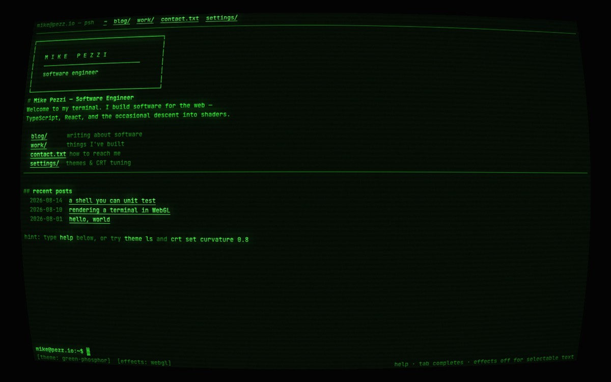
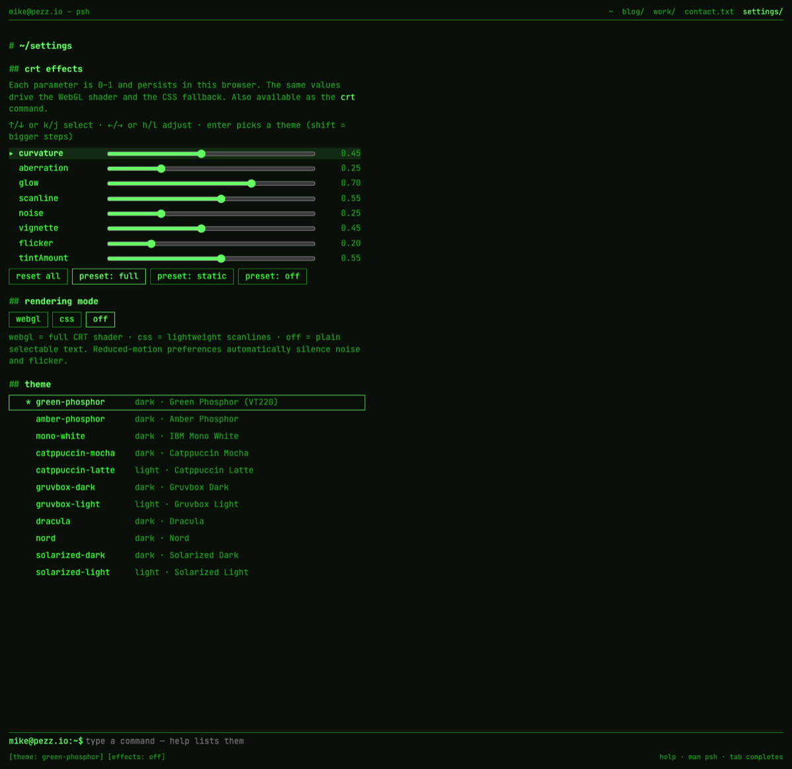

# mike.pezz.io

Personal website of Mike Pezzi — a portfolio that behaves like a unix
terminal and looks like a CRT monitor.



Pages are directories, posts are files, and the prompt at the bottom is a
real (simulated) shell. Everything is statically prerendered, fully
keyboard-navigable, and drawn through a WebGL post-processing pipeline —
barrel curvature, phosphor glow, scanlines, chromatic aberration, VHS
tracking noise, overscan vignette, flicker.

## Try it

```
help                      # list every command
cd blog                   # pages are directories
cat blog/hello-world.md   # posts are files
ls -l work                # things I've built
theme ls                  # 11 community terminal color schemes
theme gruvbox-dark        # or: theme toggle for light/dark
crt set curvature 0.8     # bend the glass
crt preset static         # calm it down
effects off               # plain selectable text
man crt                   # manual pages, generated from command metadata
grep -i webgl ~/blog      # search everything
neofetch                  # obligatory
```

Tab completes commands and paths; ↑/↓ recall history; typing anywhere
focuses the prompt. On `/settings`, vim keys work: **j/k** (or ↑/↓) move
through the CRT parameters, the rendering mode, and the theme menu;
**h/l** (or ←/→) adjust; **Enter** picks a theme.



## Stack

- **React 19** + **React Router 8** framework mode (`ssr: false` +
  `prerender`) — every route ships as static HTML, then hydrates as a SPA
- **TypeScript** strict (`noUncheckedIndexedAccess`, `exactOptionalPropertyTypes`)
- **MDX** content in `app/content/` with zod-validated frontmatter
- **Raw WebGL2** CRT pipeline — no three.js, no rendering dependencies
- **Vitest** + React Testing Library, **ESLint** (typescript-eslint,
  react-hooks, jsx-a11y), **Prettier**
- **pnpm**, GitHub Actions → GitHub Pages

## Architecture

One renderer-agnostic content model, three rendering tiers:

```
routes ──► ScreenModel (plain data) ──► DomScreen (semantic JSX)   ← SEO, a11y, "off"/"css" modes
                                    └─► CrtEngine (cell grid)      ← "webgl" mode
shell commands ──► OutputBlock[] ──► both renderers
```

- `app/shell/` — pure TS shell: VFS, tokenizer, command registry,
  completion, history. Commands are `(args, vfs, env) → CommandResult`
  returning data + effects (`navigate`, `setTheme`, …) that React
  interprets. The URL is the source of truth for `cwd`, so the back
  button behaves exactly like `cd`.
- `app/engine/` — character-cell buffer → glyph-atlas 2D canvas → WebGL2
  texture → bright-pass/blur (bloom) → composite shader. Mouse
  hit-testing runs the same barrel-warp math as the shader
  (`app/effects/params.ts` is the single source for both, guarded by a
  property test).
- `app/effects/settings-store.ts` — CRT parameters resolve as
  defaults ← theme ← preset ← user overrides; persisted in localStorage;
  driven by the `crt` command, the `/settings` sliders, and the vim keys.
- **Accessibility**: the semantic DOM stays mounted (visually clipped) in
  WebGL mode with the real prompt input focused, so screen readers,
  keyboard nav, and the mobile keyboard all work. `prefers-reduced-motion`
  silences noise/flicker. If WebGL2 is unavailable or the context is
  repeatedly lost, the site degrades to a CSS-effects tier, then plain
  DOM. Touch devices default to the CSS tier (native scrolling, zoom,
  and tap targets); the full shader stays one tap away in `/settings`.
  Text selection by mouse is the one thing shader mode gives up —
  `effects off` is always one command away.

## Develop

```sh
pnpm install
pnpm dev        # dev server
pnpm test       # unit + component tests
pnpm lint       # eslint
pnpm typecheck  # react-router typegen + tsc
pnpm build      # static build + 404.html + sitemap
pnpm preview    # serve build/client
```

Content lives in `app/content/blog/*.mdx` and `app/content/work/*.mdx`.
Frontmatter (`title`, `date`, `summary`, `tags`, `draft`) is validated at
build time — a bad file fails the build. Adding a file automatically
creates the route, the VFS entry (`~/blog/<slug>.md`), the listing rows,
and the prerendered page.

## Manual visual checklist (before release)

Things unit tests can't see — check in a real browser (`pnpm preview`):

- [ ] Each theme × each mode (webgl / css / off) renders legibly
- [ ] `crt set curvature 1` — clicks still land on links (warped hit-testing)
- [ ] Wheel scrolling in webgl mode; long posts reachable
- [ ] `/settings`: j/k/h/l walk params → mode → themes; Enter applies a theme
- [ ] Mobile viewport: tap prompt summons keyboard, grid rescales
- [ ] DevTools → disable WebGL → falls back to css mode
- [ ] OS reduced-motion: noise/flicker/blink stop everywhere
- [ ] Keyboard-only pass: tab order, menus, prompt, settings sliders

## Deploy

Push to `main` → CI (lint → typecheck → test → build) → GitHub Pages with
the `mike.pezz.io` CNAME. Set Pages source to "GitHub Actions" in repo
settings and point DNS at GitHub Pages.
